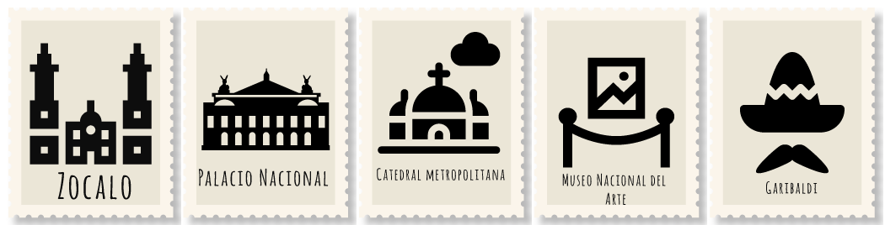

# Consensys Developer Program Spring 2019

## Final Project: Nifties Exchange - A Blockchain game for promoting tourism and crypto onboarding

- **Author**: Santiago Gonzalez Toral ([Github](https://github.com/santteegt)|[email](mailto:hernangt12re3@gmail.com))

### What is this project about?

Nifties Exchange is a dApp for incentivize the tourism on distant and not well-known attractions within big Cities, while at the same time being a useful tool for crypto onboard the masses. Its logic is basically a NFT exchange game with on-chain logic that simulates the market price of each tourism stamp artificially based on user demand and some sort of entropy found in past block hashes within the blockchain.

#### User stories

**Video Demo**: Part[ 1](https://youtu.be/WNILgIfUbe8)|[ 2](https://youtu.be/lM-U4I5F7gg)



Come and join the adventure to know new unknown places within big Cities around the globe. You will be able to claim digital stamps when visiting this places and benefit both from unique rewards on discounted attractions and by selling it later on an exchange-based game so you can earn some tokens and other people can also benefit from its availability.

- As a director of the local tourism department, you may want to incentivize people to meet some places that aren't well-known but offer attractive activities for the local/foreign visitors. So you can deploy a StampCollectible smart contract, put some funds in the `Prize pot`, and mint some stamps with a limited supply. Tourists can claim one of them via a QR code located in-place, and later use it to buy discounted goods/services on awesome attractions. A Limited supply of stamps allows you to program short-to-medium scale campaigns and incentivize people to sell them later through the built-in exchange game for a small reward based on market price which is taken from the `Prize pot`. In that way, other people can also benefit from these stamps in the future.

- As a tourist, you may want to have a more fun experience during travelling that allows you to know awesome places. Through Nifties exchange, you can find a digital guide that recommends you to visit interesting places and get rewarded for it. You just need to collect or buy digital stamps through the dApp, playing with them using and exchange-based game, use them to get discounts on local attractions and get some profit at the end by selling them at the current market value.

- As a blockchain community member, you may want to find more suitable ways to onboard crypto and decentralized applications to the masses. according to the latest [UNWTO World Tourism Barometer](http://marketintelligence.unwto.org/content/unwto-world-tourism-barometer), more than 1.4 billion of international tourist arrivals around the world have happened in 2018. Why not try to onboard that many people to blockchain? Nifties exchange allows you to do it within your locality.

### How to Setup the project locally?

#### Software Requirements

- Node v10.5.0+ ([How-to install](https://github.com/nvm-sh/nvm#installation-and-update))
- truffle v5.x.x
- MythX
- Solc 0.5.0+
- Local testnet (e.g. Ganache, ganache-cli, truffle develop, Geth, Parity, etc.) with a RPC running at http://localhost:8545
- Any Web3 enabled browser (e.g. with Metamask plugin installed) browser
- OpenZeppelin SDK (**optional** to test smart contract upgradability)

### Installation instructions

- Most of the installation requirements can be installed by executing the following command:

```bash
$ npm install -g truffle truffle-security ganache-cli
```

- Additionally, you can also install OpenZeppelin SDK if you want to deploy upgradable contracts:

```bash
npm install -g @openzeppelin/cli
```

### Project setup

In order to setup the project to be run/deploy, you need to clone/download this repo and run the following commands within the project folder:

```bash
$ npm install
$ cd client && npm install
```

If developing/running the dApp in your local computer, you need to deploy a local ganache in a separate terminal by running the following command:

```bash
$ ganache-cli
```

This will deploy a local in-memory Ethereum node on [http:localhost:8545](http:localhost:8545). Make sure you copy one or more of the generated accounts PKs, so you can import them on Metamask to interact with the web dApp later.

### How to run migrations/deploy the smart contracts

#### Using truffle

```bash
$ truffle migrate --reset # deploy to a local testnet
$ npm run migrate-rinkeby # deploy to Rinkeby testnet
```

#### Using OpenZeppelin SDK

To deploy the initial smart contracts:

```bash
sh migrate-oz.sh
```

To upgrate the StampCollectible smart contract (**NOTE**: remember to not to execute the initialize method as it was already executed for this contract):

```bash
oz upgrade StampCollectible -n development
```

### How to run the tests?

To run all developed smart contract test cases, you need to run the following command:

```bash
truffle test
```

### How to run MythX?

In order to perform an automated smart contract security analysis using MythX, you need to execute the following commands:

```bash
$ export MYTHX_ETH_ADDRESS=0x1234567891235678900000000000000000000000
$ export MYTHX_PASSWORD='Put your password in here!'
$ truffle run verify [contract]
```

### How to deploy the dApp

After the smart contract were migrated to your preferred Ethereum blockchain, you need to run the following commands in a terminal:

```bash
$ cd client && npm start
```

This will deploy the dApp locally on [http:localhost:3000](http:localhost:3000)

### How to use the dApp on a public testnet?

Currently, all smart contracts are deployed on the Ethereum `Rinkeby` testnet. You can find the corresponding addresses and Etherscan URLs pointing to the verified code in [deployed_addresses](deployed_addresses.md)

In case you want to test the deployment to Rinkeby, make sure you fund your test account using the [Faucet server](https://faucet.rinkeby.io). Then, copy the mnemonic words of your Metamask account and paste them in a `.secret` file on the root directory of the project. Finally, you can run the following migration command:

Smart contracts and unit tests were properly documented using the [natspec style guidelines for comments](https://solidity.readthedocs.io/en/v0.5.2/style-guide.html#natspec). A detailed explanation of each test suite is provided on each of the test source code files in the [test](test/) directory.

### Design Patterns Decisions

A detailed explanation of the design patterns used in the dApp can be found [here](design_patterns_decisions.md)

### Avoiding Common Attacks

A detailed explanation of what measures were taken to ensure that Nifties Exchange contracts are not susceptible to common attacks can be found [here](avoiding_common_attacks.md)

### License

[Licence](LICENSE)
